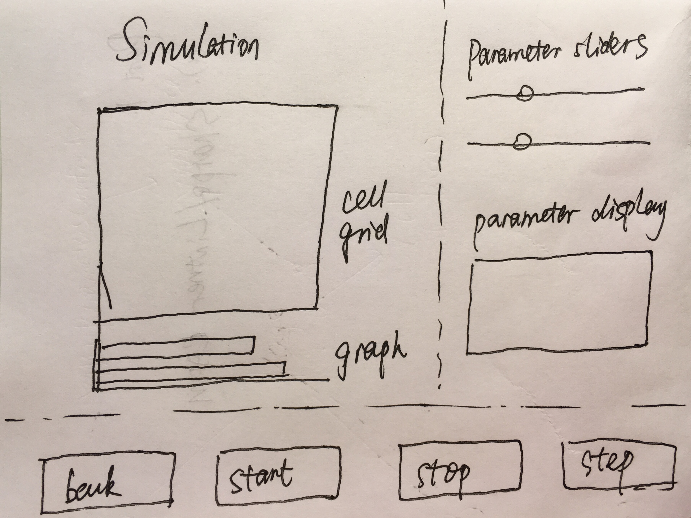

# Design for Cell Society

## Introduction
In this program, our group seeks to create a functional cell society simulator that can handle a variety of animations and has the flexibility to handle more being added to the program. Our group seeks to use inheritance for all of the animations, making sure they are all children of the animation parent class and that more animation child classes can be added to handle different animations. Our CellSociety main class will have instances of the other classes, meaning that instances of CellSociety have the ability to access other classes, but they do not have access to each other. The use of this master class will allow for flexibility without the corruption of information between classes. We think that intelligent uses of inheritance and private variables will lead to a well-designed, expandable, and fully functional program. 

## Overview

**Here's a look at the design:**

{:height="100px" width="150px"}

The three main classes are Cell Society, Page (Super class), and Cell (Super class). The Cell Society class contains all of the pages of our program. In addition, it will refer to the Animation Super class, which handles the individual calculations used to update the display results graphically. The Animation super class will include a timer/timeline and will make use of inheritance to handle different animations. The Page subclasses will extend the Page Superclass to allow for future extension of code. This increases the flexibility of the code, allowing us to declare a welcome page, level pages, etc without a lot of duplicate code. The pages all contain cell instances. 

## User Interface
For our user interface, the user is first given a splash screen with a selection of animations and a play button. The other scene will display the animation and will continue running until the user clicks a button which brings them back to the main menu. If the user wants to interact with how the program performs, they can edit the XML files provided with the program to change the behavior, starting percentages, and the like. 

The only foreseeable error happens when an XML file is not properly input in a way which the program can read. Using a try-catch, we will not allow the animation to launch if there is an error in the way that the XML file is read in.

**Here's a look at the menu:**
 

**Here's a look at a level UI:**
 

## Design Details 
Overall Goal: Able to change number of cells and number of simulations easily.

We design to implement following classes in our program, and their major variables and methods are also listed. Bold fonts indicate there is some collaboration between this variable/method with other variables/methods. 

- `Main`: the class to launch the game
- `CellSociety`: the class to manage the entire game
	- **`private Page[] pages`**: all `Page` instances that the program contains, including 1 `Page` for splash screen, and 1 `Page` for each animation.
	- **`private Animation[] animations`**: all `Animation` instances that the program requires to control the game. 1 `Animation` instance for each animation, used to call methods in the corresponding `Animation subclass`.
	- `public CellSociety()`: constructor of the class `CellSociety`
	- `private void initializeWelcomePage()`: initialize the splash screen
	- `private void initializeSimulationPage(int typeOfSimulation)`: initialize a `Page` for a specific simulation game
	- `private void setupGameLoop()`: manage the game loop
	- `private void startGameLoop()`: start the game loop
	- `private void endGameLoop()`: stop the game loop
	- `private void actionsPerFrame(double elapsedTime)`: called by `setupGameLoop()` to control actions in each frame
	- **Other methods in `Animation` subclasses** are called by `actionsPerFrame()` through the `animation` variable to control actions during simulation.
- `Page`: superclass for different types of scenes
	- `public static final int WIDTH`: width of the 2D game screen
	- `public static final int HEIGHT`: height of the 2D game screen
	- `private Scene scene`: the `Scene` to hold all component nodes
	- `private Group root`: the root node in the scene
	- `public Page()`: constructor of the class `Page`, initializing scene and root
	- `private void readInputXML(String path)`: read input XML file from the given path, and store parameters in class variables (if necessary, this method can be abstract and to be implemented in each subclass).
- `Page`: Subclasses responsible for each scene
	- `Welcome Page`: setup instructions, drop down menu for the user to choose the animation they want to play with
		- `private Text title`: the title and other introduction messages shown on the splash screen
		- `private ComboBox menu`: the drop down menu to choose animation
		- `public WelcomePage()`: the constructor of the Welcome Page, calls **superclass constructor**
		- **`private int handleChoices ()`**: return which animation to load (an integer index) based on ComboBox choice
	- `Specific Cell Society Page`: Set up cells and parameters for each animation (one class for each animation)
		- `private Cell[][] cells`: all cells in the animation
		- some variables to store XML input parameters
		- `private TextBox parameters`: the text field to tell the user current simulation parameters (which are read from XML file).
		- **`private Button back`**: the button to navigate the user back to the splash screen
		- `private XXX()`: the constructor for the class, call the `readInputXML()` method to read parameters and assign them to class variables, set up parameter text field, set up cells according to parameters, and **add cells to the scene**.
		- **`private void updateCells(//some inputs to indicate changed cells and new status)`**: to change status of all required cells, for each cell, the `changeStatus()` method in the class `Cell` will be called. 
		- `private void updateParameters()`: to handle user adjustment for simulation parameters.
- `Cell`: class for one cell in the simulation
	- `private Rectangle rectangle`: the basic shape of `Cell`
	- `private int status`: indicator of cell status
	- `public Cell (double xPosition, double yPosition, int status)`: constructor of the `Cell` class. Pin down the x and y coordinates of the cell, and initialize the status of the cell.
	- **`public Rectangle getCell()`**: get the rectangle variable for the cell to be added to scene in class Page
	- `private void changeStatus(int newStatus)`: change cell status to the input variable. 
- `Animation`: Superclass for the other animations. Allow for the declaration of a generic Animation class.
- `Animation`: Subclasses for each individual animation (each game). Update and handle situations in the right way.
	- **`private CellSociety cellsociety`**: the `CellSociety` instance of the program, to get access to pages, scene, and cells in the animation.
	- `public Animation(CellSociety theCellSociety)`: constructor of the class. When an `Animation subclass` instance is initialized in `CellSociety`, the calling `CellSociety` instance will be passed into the constructor.
	- **`private void calculateMove()`**: the major method to implement rules of each animation. Other methods called by it will be implemented as required. If some cells need to change status, the `updateCells()` method in the corresponding `Page` subclass will be called.

To extend the program, we have come up with several possible new requirements and their solutions:

 1. Add a new type of simulation.
	Firstly one more choice should be added to the ComboBox drop down menu in the splash screen. And one `Page subclass` and one `Animation subclass` will be implemented to handle specific layouts and rules of the new simulation.
	
 2. Allow for the user to adjust simulation parameters
	In each `Page` subclass, we need to replace the current `TextBox` with sliders for all parameters, and add corresponding methods to handle slider events. 

Use Cases Analysis

 1. Apply rules to a middle cell 
 
	Method  `calculateMove()` in the `Animation subclass` for Game of Life is responsible for defining the rules, doing the calculation and applying changes by calling other methods.
	
    Methods `updateCells()` in `Page subclass`, and `changeStatus(int newStatus)` in `Cell` class will be consecutively called to apply the changes to the cell.
 2. Apply rules to an edge cell

	Because we use border cells around normal cells, all valid cells in the animation will be regarded as middle cells, eliminating special treatment for edge cells. It is safe to apply the rules of Game of Life. But we need to pay attention to specific cases in other animations.
 
 3. Move to the next generation

	Method `actionsPerFrame()` in the `CellSociety` class (and methods called by it in `Animation subclass`) is responsible for updates. We regard each frame as one step, and in each step, rules will be applied and cells status will be updated.
 
 4. Set a simulation parameter 

	Currently all simulation parameters are read in from XML files. If a user want to set the parameter, he or she has to modify the XML file and restart the game. Refer to game extensions 2 for details on how to allow the user to adjust parameters.
 
 5. Switch simulation
 
	During one simulation, if the user wants to switch to another one, he or she has to click the “back to main menu” button on the simulation page back to the splash screen, and choose a new type from its drop down menu.

## Design Considerations 

 1. Border cells
 
	To reduce implementation complexity, we add a layer of invisible border cells around normal cells, so that all valid cells will be considered as middle cells. However, we will be careful on how to count neighbors for each simulation rule.

 2. Dependencies among classes
 
	A lot of dependencies among classes are in the program design.

 3. `Animation` is where all the individual rules are executed
 
	We extract out a separate class to handle simulation updates in each step, instead of wrapping everything in the `CellSociety` class.

 4. Parameters can only be modified in XML files
 
	Currently for simplicity, parameters can only be read from XML files and there is no interaction between the user and the simulation. If a user wants to change parameters, the only method is to modify XML files. After initial implementation, this shortcoming will be improved.

 5. Report errors on parameters to the user
 
	When errors regarding formats on input files and parameters occur, error messages instead of loaded cells will be displayed on the screen. 

## Team Responsibilities

> All group members will help out with the `Animation` superclass and subclasses (rules for making sure we get the right patterns). First checkpoint (responsibilities below) is just to write out the skeleton (variable names, imports, etc) of each class.

Yilin Gao: implement the `Page` superclass and its subclasses. Connect classes together.

Harry Liu: implement `Main` and `Cells` superclass and its subclasses. Connect classes together.

Josh Kopen: implement `Cell Society` and `Animation` superclass and its subclasses. Connect classes together.

